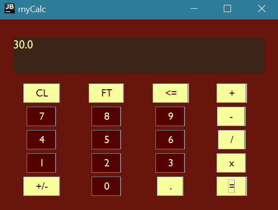

# Calculator Application
This is a basic GUI Calculator Application. You can use the onscreen buttons or keyboard buttons for input. 
I made this project to get practice with Swing and GUI FormBuilding. So, the code can be much improved. 

Example: Some basic addtion

